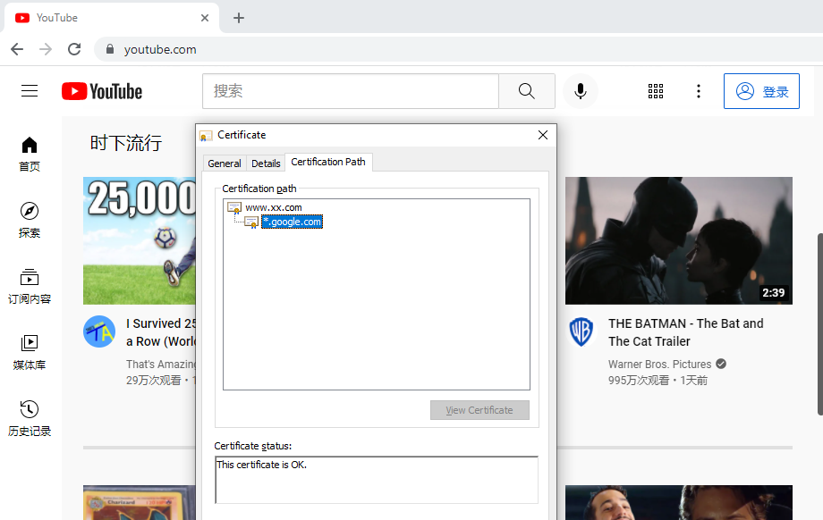

# Simple Http Proxy
[](https://www.python.org/)
[](https://www.python.org/)
[](https://www.python.org/)
[](https://app.fossa.com/projects/git%2Bgithub.com%2Fzgjsxx%2Fsimple-http-proxy?ref=badge_shield)

simple_http_proxy is a http/https proxy, it used ossrs/state-threads as its base coroutine library.

It also has a inside http api server.

## Usage
To build simple http proxy from source:

```shell
git clone https://github.com:zgjsxx/simple-http-proxy.git &&
cd simple-http-proxy && ./configure && make &&
./output/myproxy -c conf/srs.conf
```

And then you will see the proxy is work on 0.0.0.0:8080.

After starting the proxy, you can set the proxy address in the system or install a plugin in the browser to set it.
When you visit the website by the browser, you can see the certificate has been replaced by our proxy. It means the descryption is successful.



## Features

Please read [FEATURES](doc/features.md).

## Ports

Please read [PORTS](doc/resources.md#ports).

## TODO

Please read [TODO](doc/todo.md).


## License
[](https://app.fossa.com/projects/git%2Bgithub.com%2Fzgjsxx%2Fsimple-http-proxy?ref=badge_large)


NJ, 2022.12

zgjsxx
